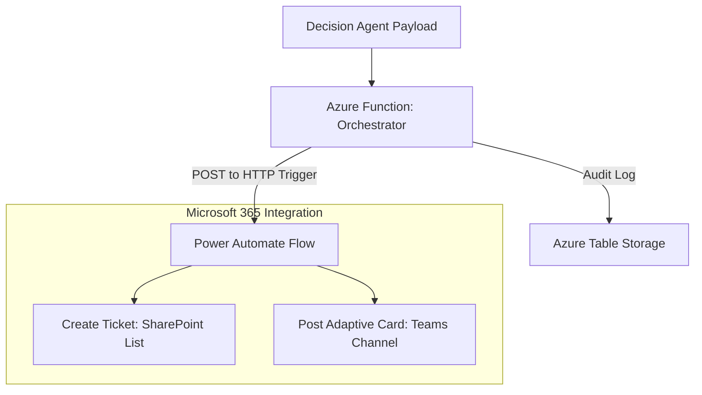

# Action Agent: Technical Blueprint

This document details the final orchestration layer that translates AI decisions into business actions across the Microsoft 365 ecosystem.

## 1. Action Workflow Orchestration



---

## 2. Microsoft Teams: Adaptive Card JSON

```json
{
  "type": "AdaptiveCard",
  "version": "1.4",
  "body": [
    {
      "type": "TextBlock",
      "text": "🚨 Predictive Maintenance Alert",
      "weight": "Bolder",
      "size": "Large",
      "color": "Attention"
    }
  ]
}
```
