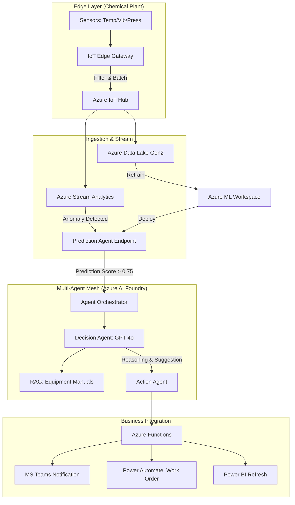

# Industrial Multi-Agent System: Technical Blueprints

This document provides the low-level technical specifications for the Predictive Maintenance architecture.

## 1. System Data Flow (Mermaid)



---

## 2. Infrastructure-as-Code (Bicep Snippet)

This snippet defines the core IoT and Storage infrastructure with Managed Identities.

```bicep
// Core Storage for Data Lake
resource storageAccount 'Microsoft.Storage/storageAccounts@2022-09-01' = {
  name: 'stpmchemicalprod001'
  location: resourceGroup().location
  sku: { name: 'Standard_LRS' }
  kind: 'StorageV2'
  properties: {
    isHnsEnabled: true // Enable Data Lake Gen2
    networkAcls: {
      defaultAction: 'Deny'
      bypass: 'AzureServices'
    }
  }
}

// Azure AI Foundry / OpenAI Service
resource openAIService 'Microsoft.CognitiveServices/accounts@2023-05-01' = {
  name: 'oai-pm-agents'
  location: 'westeurope' // GDPR Compliance
  kind: 'OpenAI'
  sku: { name: 'S0' }
  properties: {
    customSubDomainName: 'oai-pm-agents'
    publicNetworkAccess: 'Disabled'
  }
}
```

---

## 3. Maintenance Logic
1. **Blue/Green Deployment**: Use Azure AI Foundry "Deployments" versions to swap between GPT-4-turbo and GPT-4o models for the Decision Agent.
2. **Entra ID integration**: All agents operate under a "Service Principal" with specific RBAC roles (e.g., *Cognitive Services User*).
