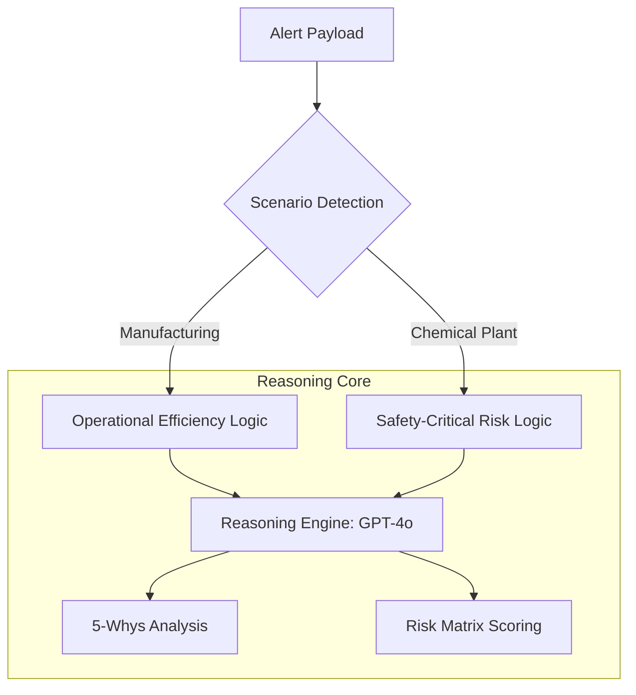

# Decision-Making AI Agent: Production Blueprint

This blueprint details the reasoning logic, safety guardrails, and prompt engineering required for a "High-Confidence" Decision Agent on Azure.

## 1. Multi-Scenario Reasoning Architecture

---

## 2. Refined Master Prompt Template (Excerpt)

# Safety Logic & Guardrails (Chemical Plant)
- **Rule 1**: If RUL < 12 hours AND Temperature is rising, recommend 'SHUTDOWN'.
- **Rule 2**: If Pressure > 90% of Rated Limit, trigger 'EMERGENCY_VENT'.
- **Rule 3**: Never suggest a maintenance action that involves opening a pressurized vessel without confirming 'DEPRESSURIZATION_COMPLETE'.
