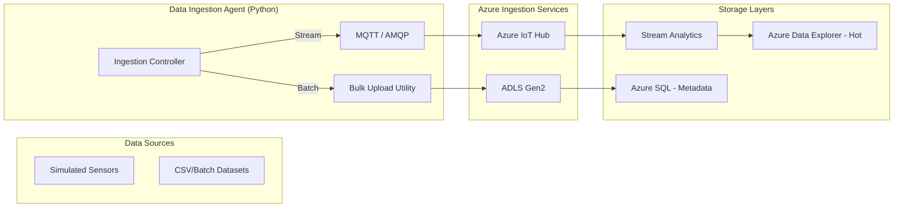

# Data Ingestion Agent: Technical Blueprint

This document provides the implementation details for the first agent in our multi-agent predictive maintenance system.

## 1. Ingestion Architecture



---

## 2. Sample Schema Design

### A. JSON Telemetry (Streaming)
Used for real-time messages sent to IoT Hub.
```json
{
  "header": {
    "msg_id": "9821-abc-123",
    "timestamp": "2024-04-18T21:30:00Z",
    "device_id": "REACTOR-001"
  },
  "payload": {
    "temperature": 185.4,
    "pressure": 12.8,
    "vibration": 0.045,
    "flow_rate": 250.0
  },
  "status": "OPERATIONAL"
}
```
