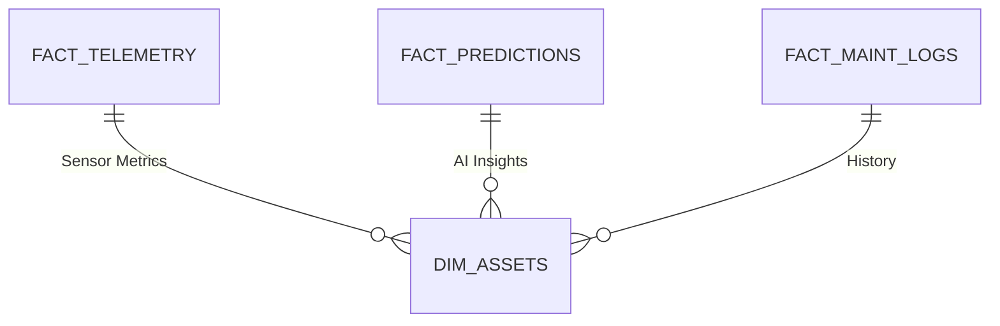

# Power BI Dashboard: Technical Blueprint

## 1. Data Model (Star Schema)



---

## 2. Core DAX Measures

### Asset Health Index (0-100)
```dax
HealthIndex = 
VAR AvgAnomaly = AVERAGE(Fact_Predictions[AnomalyScore])
RETURN (1 - AvgAnomaly) * 100
```
